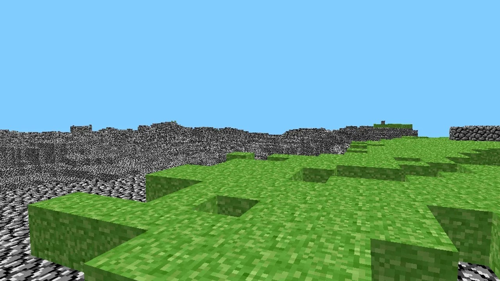

# 0. Ресурсы, используемые модули
[Minecraft — Википедия (wikipedia.org)](https://ru.wikipedia.org/wiki/Minecraft)
[Minecraft: история создания, описание - CQ](https://cq.ru/articles/gaming/istoriia-sozdaniia-minecraft)
[История Minecraft и её создателя. Кто и когда сделал легендарную игру — Игромания (igromania.ru)](https://www.igromania.ru/article/31609/Istoriya_Minecraft_i_eyo_sozdatelya._Kto_i_kogda_sdelal_legendarnuyu_igru.html)
[Как Minecraft устроена за кадром — Minecraft на DTF](https://dtf.ru/s/minecraft/202337-kak-minecraft-ustroena-za-kadrom)


[ursina engine](https://www.ursinaengine.org/index.html)
[ursina engine samples](https://www.ursinaengine.org/samples.html)

```
ursina
perlin_noise
matplotlib
numpy
```
# 1. Почему именно Python?
**Программирование** - это процесс создания инструкций для компьютера, чтобы он мог выполнять различные задачи. Компьютер - это устройство, которое умеет работать только с числами и буквами, поэтому нам нужен специальный язык, чтобы общаться с ним. Такой язык называется языком программирования.

Существует много разных языков программирования, каждый из которых имеет свои особенности и применение. Например, есть языки, которые используются для создания веб-сайтов, мобильных приложений, игр, анимации и т.д. Один из самых популярных и универсальных языков программирования - это **Python**.

**Python** - это язык программирования высокого уровня, то есть он близок к естественному человеческому языку и легко читается. Python также имеет много готовых библиотек и модулей, которые расширяют его возможности и позволяют решать разнообразные задачи. Например, с помощью Python можно создавать игры, анализировать данные, обрабатывать изображения и звук, работать с искусственным интеллектом и машинным обучением и многое другое.

- Множество  обучающего материала  и большое сообщество  
- Легкость и понятность кода  
- Большое количество библиотек для разных задач  
- Кроссплатформенность

Вот пример кода на Python:

```python
# Это комментарий. Он не влияет на работу программы, но помогает понять ее лучше.
# Комментарии начинаются с символа #

# Импортируем модуль random, который позволяет генерировать случайные числа
import random

# Создаем переменную number и присваиваем ей случайное число от 1 до 10
number = random.randint(1, 10)

# Выводим сообщение на экран
print("Я загадал число от 1 до 10. Попробуй угадать!")

# Создаем бесконечный цикл
while True:
    # Запрашиваем у пользователя ввод числа
    guess = input("Введи свой вариант: ")
    # Преобразуем введенное значение в целое число
    guess = int(guess)
    # Сравниваем введенное число с загаданным
    if guess == number:
        # Если числа равны, то выводим сообщение об успехе и выходим из цикла
        print("Ура, ты угадал!")
        break
    # Иначе, если введенное число меньше загаданного, то выводим подсказку
    elif guess < number:
        print("Нет, мое число больше.")
    # Иначе, если введенное число больше загаданного, то выводим подсказку
	else:
        print("Нет, мое число меньше.")
```
Как ты думаешь, что делает эта программа? Попробуй запустить ее и поиграть в нее. Это простая игра, в которой ты должен угадать число, которое загадал компьютер. Компьютер дает тебе подсказки, если ты не угадал с первого раза. Эта игра демонстрирует некоторые основные элементы программирования на Python, такие как переменные, функции, циклы, условия и операторы.

# 2. Почему именно Minecraft?
Minecraft - это компьютерная игра в жанре песочницы, созданная шведским программистом Маркусом Перссоном и выпущенная его студией Mojang. Игроки могут свободно строить и разрушать блоки, создавать различные предметы и взаимодействовать с другими игроками в многопользовательском режиме.

- Minecraft был создан шведским программистом Маркусом Перссоном, известным под псевдонимом Notch.
- Перссон начал работу над игрой в мае 2009 года, вдохновившись такими играми, как Dwarf Fortress, Dungeon Keeper и Infiniminer.
- Первая версия игры, называемая Classic, была опубликована на официальном сайте в июне 2009 года. Она была бесплатной и позволяла игрокам строить из разных блоков в режиме креатива.

**Cave Game**


# 3. Игровые движки и знакомство с Ursina
Игровой движок - это набор программного обеспечения, необходимый для работы компьютерных игр и не привязанный жестко к какой-либо из них. Игровой движок облегчает создание игр, предоставляя разработчикам готовые решения для таких задач, как отрисовка графики, обработка физики, управление звуком, вводом и сетью. Игровой движок также позволяет переносить игры на разные платформы, такие как ПК, консоли, мобильные устройства и т.д.

Существует много разных игровых движков, каждый из которых имеет свои особенности и применение. Например, есть игровые движки, которые специализируются на создании 2D-игр, 3D-игр, VR-игр и т.д. Один из самых популярных и универсальных игровых движков - это Unity. Unity поддерживает множество платформ и жанров, имеет удобный редактор сцен и ассетов, а также мощный язык программирования C#.

Мы будем использовать другой игровой движок, который называется Ursina. Ursina Engine — это полноценный движок под Windows, Linux и Mac, написанный на Panda3D, Pillow. Его можно использовать для создания 2D- и 3D-игр. В комплекте библиотеки — готовые шейдеры, геометрические примитивы и анимации. Ursina имеет следующие преимущества:
- Ursina работает на Python.
- Ursina имеет современный дизайн и интерфейс. Ursina также имеет встроенные элементы управления для камеры, мыши и клавиатуры.
- Ursina бесплатна и открыта для изменений. Ursina распространяется под лицензией MIT, которая позволяет использовать Ursina для любых целей.

Для того, чтобы начать работать с Ursina, нам нужно установить несколько программ на наш компьютер.
```python
# Импортируем модуль ursina, который содержит все необходимые классы и функции для работы с игровым движком
from ursina import *

# Создаем объект app, который представляет собой приложение Ursina
app = Ursina()

# Создаем объект cube, который представляет собой сущность (Entity) - основной класс для создания игровых объектов
# Указываем параметры сущности, такие как модель (model), текстура (texture), цвет (color), размер (scale)
cube = Entity(
	model="cube",
	texture="white_cube",
	color=color.red,
	scale=2,
)

# Создаем функцию spin, которая будет вызываться при клике на куб
def spin():
	# Анимируем поворот куба по оси Y на 360 градусов за 2 секунды с помощью метода animate
	cube.animate(
		"rotation_y",
		cube.rotation_y + 360,
		duration=2,
		curve=curve.in_out_expo,
	)

# Привязываем функцию spin к событию on_click куба с помощью оператора присваивания
cube.on_click = spin

# Создаем объект camera, который представляет собой камеру редактора (EditorCamera) - специальный класс для управления камерой в режиме разработки
camera = EditorCamera()

# Запускаем приложение Ursina с помощью метода run объекта app
app.run()
```
>Результат:
>
>*Чтобы управлять камерой зажми правую кнопку мыши и тяни мышь в разные стороны!*


Это простая демонстрация возможностей Ursina. Ты увидишь красный куб в центре экрана. Ты можешь управлять камерой с помощью мыши и клавиатуры. Ты можешь кликнуть на куб левой кнопкой мыши и он начнет вращаться. Эта программа демонстрирует некоторые основные элементы работы с Ursina, такие как создание сущностей, анимация, ввод и коллизия.

# 4. Начало разработки своего Minecraft
Ниже представлен шаблон кода для любого проекта на Ursina
```python
# Необходимые импорты
from ursina import *

# Инициализация окна игры
app = Ursina() 

# здесь будет описана игровая логика

# Запускаем проект
app.run()
```

>Результат:
>

Давай прежде чем переходить к работе с игровыми объектами сделаем так, чтобы исчезла кнопка закрытия окна, но при этом мы могли закрывать игру при помощи клавиши Q или ESC. Добавим в код функцию `input`, которая позволяет считывать вводимые в игре клавиши и реагировать на них как нам нужно.
Код примет следующий вид:
```python
# Необходимые импорты
from ursina import *

# Инициализация окна игры
app = Ursina()

# Убираем кнопку закрытия окна
window.exit_button.visible = False

# Определяем функцию input с одним параметром key
def input(key):
    # Проверяем, равна ли переменная key строке "q" или "escape"
    if key == "q" or key == "escape":
        # Если да, то вызываем функцию quit, которая завершает работу приложения Ursina
        quit()

# Запускаем проект
app.run()
```

## 4.1. Entity
Объект **Entity** - это основа для всех сущностей в игре. С его помощью можно создавать разные элементы игрового мира, например, фигуры (кубы, сферы, пирамиды и т.д.) или модели (персонажи, предметы и т.д.). Для наполнения карты воспользуемся им.
Дальше будем приводить только новые фрагменты кода, но с пояснением, куда его необходимо вставлять.
```python
# Прошлый код
...

# Создаем двойной цикл for, который повторяется 16 раз по переменным x и z
for x in range(16): 
	for z in range(16):
	    # Создаем сущность в виде куба с белой текстурой и задаем ей позицию в пространстве по координатам x, 0 и z
	    Entity(model="cube", texture="white_cube", position=Vec3(x,0,z))

# Запускаем проект
app.run()
```
>Результат:
>

## 4.2. FirstPersonController
Программа покажет на экране плоское изображение. Для просмотра блочной сцены в 3D нужен наблюдатель. Его можно создать с помощью готового объекта FirstPersonController.

Полный код представлен ниже:
```python
# Необходимые импорты
from ursina import *
# импортируем объект игрока
from ursina.prefabs.first_person_controller import FirstPersonController

# Инициализация окна игры
app = Ursina()

# Убираем кнопку закрытия окна
window.exit_button.visible = False

# Определяем функцию input с одним параметром key
def input(key):
    # Проверяем, равна ли переменная key строке "q" или "escape"
    if key == "q" or key == "escape":
        # Если да, то вызываем функцию quit, которая завершает работу приложения Ursina
        quit()

# Создаем двойной цикл for, который повторяется 16 раз по переменным x и z
for x in range(16): 
	for z in range(16):
	    # Создаем сущность в виде куба с белой текстурой и задаем ей позицию в пространстве по координатам x, 0 и z
	    Entity(model="cube", texture="white_cube", position=Vec3(x,0,z))

# Создаем объект player, который представляет собой контроллер от первого лица (FirstPersonController) - специальный класс для управления персонажем в 3D-играх
player = FirstPersonController()

# Устанавливаем свойство gravity объекта player равным 0.0, что означает, что персонаж не подвержен гравитации и не падает вниз
player.gravity = 0.0

# Запускаем проект
app.run()
```

>[!info] Важно!
>Игроком по умолчанию можно управлять с помощью мышки и кнопок W, A, S, D. Но есть особенность: если переключиться на русскую раскладку, то при нажатии кнопки возникнет ошибка. Не забудь переключить раскладку!

>Результат:
>

Программа покажет тебе базовую сцену из блоков. Она еще не очень интересная, но ты уже можешь по ней ходить!

## 4.3. Текстурирование
Ursina Engine дает возможность использовать свои текстуры и модели, а не только стандартные.

### 4.3.1. Текстурирование блоков
Для начала стоит создать и раскрасить блоки. Нужно сначала сделать модель в Blender, потом подготовить текстуру и затем импортировать объект в программу. 
Мы же возьмем уже готовые объект и текстуру.

Модель блока находится в папке `models` под названием `block.obj`, а текстура травы для него - в папке `textures` под названием `grass.png`. Если хочешь, можешь взять и другую текстуру из находящихся в этой папке, кроме `arm.png`.

Для начала создадим переменную с нашей загруженной текстурой, а затем будет использовать её и нашу модель `block` при создании объектов `Entity` в циклах.

```python
# Прошлый код
...

# загружаем текстуру
grass_texture = load_texture('assets/grass.png')

# Создаем двойной цикл for, который повторяется 16 раз по переменным x и z
for x in range(16): 
	for z in range(16):
	    # Создаем сущность в виде БЛОКА с НАШЕЙ текстурой и задаем ей позицию в пространстве по координатам x, 0 и z
	    Entity(model='models/block', scale=0.5, texture=grass_texture, position=(x, 0, z))

...
# Прошлый код
```

>Результат:
>!

### 4.3.2. Текстурирование персонажа
Так же можно сделать и руку персонажа. Сперва — подготовить текстуру для модели в Blender, потом — привести ее в программу через Entity. Чтобы прикрепить руку к камере персонажа, нужно настроить параметры — положение и угол.
Мы же снова воспользуемся готовыми объектом и текстурой руки.

Как и раньше, модель руки находится `models/arm.obj`, а текстура - `textures/arm.png`.

```python
# Прошлый код
...

# ЗДЕСЬ ФУНКЦИЯ input

# Загружаем текстуру для руки
arm_texture = load_texture("textures/arm.png")

# Создаем сущность в виде руки и присваиваем ее переменной hand
hand = Entity(
	# Указываем камеру, чтобы рука всегда была видна на экране
	parent=camera.ui,
	# Указываем модель
	model="models/arm",
	# Указываем текстуру
	texture=arm_texture,
	# Указываем масштаб сущности как 0.2, чтобы рука не была слишком большой или маленькой
	scale=0.2,
	# Указываем поворот, чтобы рука имела правильную ориентацию
	rotation=Vec3(150, -10, 0),
	# Указываем позицию, чтобы рука была в нижнем правом углу
	position=Vec2(0.6, -0.6),
)

...
# Прошлый код
```

>Результат:
>

### 4.3.3. Текстурирование неба
Entity поможет тебе сделать небо — достаточно создать модель сферы с текстурой неба и ее использовать.

Как и раньше, текстура неба - `textures/sky.png`.

```python
# Прошлый код
...

# ЗДЕСЬ КОД ДЛЯ РУКИ HAND

# Загружаем текстуру
sky_texture = load_texture("textures/sky.png")

# Создаем сущность в виде неба и присваиваем ее переменной sky
sky = Entity(
	# Указываем модель сферы
	model="sphere",
	# Указываем текстуру
	texture=sky_texture,
	# Указываем масштаб, чтобы небо было достаточно большим
	scale=1000,
	# Указываем, чтобы текстура неба была видна с обеих сторон сферы
	double_sided=True,
)

...
# Прошлый код
```

>Результат:
>
>*Получаем красивое небо!*

## 4.4. Включение блоков Button
Некоторые блоки нельзя «ломать». Чтобы сделать игру интерактивной, нужен особый объект Button. Он умеет работать с функцией input и методом destroy, которые помогают разбивать блоки. Создадим свой собственный класс таких блоков на основе Button. Добавим так же звуковое сопровождение для установки и удаления блока.

Убираем из кода прошлый цикл!
```python
# Прошлый код
...

# Загружаем текстуру для травы
grass_texture = load_texture("textures/grass.png") # Эта строка уже есть!

# Новый код идет дальше

# Загружаем звук
punch_sound = Audio("sounds/punch.wav", loop=False, autoplay=False)

# Создаем класс Voxel, специальный класс для создания интерактивных объектов
class Voxel(Button):
	# Определяем конструктор
	def __init__(self, position=(0, 0, 0), texture=grass_texture):
		super().__init__(
			# Указываем сцену, чтобы объект был виден в игре
			parent=scene,
			# Указываем модель объекта
			model="models/block",
			# Указываем масштаб объекта
			scale=0.5,
			# Указываем текстуру объекта
			texture=texture,
			# Указываем позицию объекта
			position=position,
			# Указываем точку опоры объекта
			origin_y=0.5,
			# Указываем цвет объекта как случайный оттенок зеленого
			color=color.color(0, 0, random.uniform(0.9, 1)),
		)
	# Определяем метод input класса, который принимает один параметр: key
	def input(self, key):
		# Проверяем, наведен ли курсор мыши на объект
		if self.hovered:
			# Проверяем, нажата ли правая кнопка мыши
			if key == "right mouse down":
				# Воспроизводим звук
				punch_sound.play()
				# Создаем объект Voxel с текстурой и позицией
				Voxel(position=self.position + mouse.normal, texture=grass_texture)
				
			# Проверяем, нажата ли левая кнопка мыши
			if key == "left mouse down":
				# Воспроизводим звук
				punch_sound.play()
				# Уничтожаем текущий объект
				destroy(self)


# Создаем двойной цикл for, который повторяется 16 раз по переменным x и z
for x in range(16):
	for z in range(16):
		# Создаем объект Voxel с текстурой grass_texture и позицией по координатам x и z
		Voxel(position=(x, 0, z))
```

>Результат:
>
>*Теперь можно строить!*

>[!info] Чтобы персонаж мог прыгать, убери строку `player.gravity = 0.0`!

## 4.5. Генерация мира
Когда количество объектов в игровой сцене не ограничено, можно создать мир похожий на Minecraft. Для этого нет готовых функций. Но есть легкий метод — сделать матрицу из шумов Перлина и поочередно «рисовать» ее в игре.

>[!info] Матрица из шумов Перлина
Шум Перлина — это способ процедурной генерации по псевдослучайному алгоритму. Принцип такой: вы вводите число seed, на основе которого создается текстура поверхности.

При одинаковом значении seed шум не изменится, если не настроить внутренние параметры алгоритма.

Попробуй сгенерировать различные шумы Перлина! Для этого открой в боковой панели файл `perlin_test.py` и пробуй запускать код, при этом меняя значение `seed=*твое число*`!
Так же можно изменять значение `terrain_width` (размер шума) и `octaves` (насколько часто меняется высота).
>Пример работы программы:
>`octaves = 2, seed = 2023, terrain_width = 64`
>

Используем такой алгоритм в генерации сложного ландшафта.
В основе шума Перлина лежит двумерный массив с гладкими возвышениями и углублениями по оси y. Его легко внедрить в игру.

Создадим шум Перлина перед двойным циклом. Перед этим добавим важную строку в самом начале.

```python
# Необходимые импорты
from ursina import * # ЭТОТ ИМПОРТ УЖЕ ЕСТЬ В КОДЕ!
from numpy import floor # НЕОБХОДИМО ДОБАВИТЬ!
from perlin_noise import PerlinNoise # НЕОБХОДИМО ДОБАВИТЬ!

...
# Прошлый код
...

Class Voxel(Button):
	...

# Создаем объект noise, который представляет собой шум Перлина
# Указываем параметры шума, такие как количество октав (octaves) - уровней детализации шума, и зерно (seed) - начальное значение для генерации
noise = PerlinNoise(octaves=2, seed=2023)
# Создаем переменную am которая определяет амплитуду шума - максимальное отклонение от среднего значения
amp = 6
# Создаем переменную, которая определяет частоту шума - количество повторений шума на единицу длины
freq = 24
# Указываем ширину и длину 
terrain_width = 30

# Создаем двумерный список landscale, который будет хранить высоты блоков по координатам x и z
# Инициализируем список нулевыми значениями размером terrain_width на terrain_width
landscale = [[0 for i in range(terrain_width)] for i in range(terrain_width)]

# Создаем цикл for, который перебирает все позиции блоков
for position in range(terrain_width**2):
    # Вычисляем координату x 
    x = floor(position / terrain_width)
    # Вычисляем координату z 
    z = floor(position % terrain_width)
    # Вычисляем координату y
    # Для получения значения шума Перлина используем метод noise
    y = floor(noise([x / freq, z / freq]) * amp)

    # Присваиваем значение y в списке landscale по индексам x и z
    landscale[int(x)][int(z)] = int(y)


# Создаем двойной цикл for, который перебирает все координаты x и z
for x in range(terrain_width):
    for z in range(terrain_width):
        # Создаем объект block класса Voxel, который представляет собой интерактивный блок в игре
        # Указываем параметры блока, такие как позицию по трем осям (x, y и z), используя значение y из списка landscale по индексам x и z
        block = Voxel(position=(x, landscale[x][z], z))

...
# Прошлый код
```

>Результат:
>
>*Теперь мир не просто плоский!*

>[!info]
> Таким же способом можно создавать не только поверхности, но и, скажем, рудники. Только для них применяются черви Перлина. Больше информации о разнообразных алгоритмах и основах генерации мира есть [здесь](https://habr.com/ru/articles/673268/).

## 4.6. Последние штрихи
Строить одним видом блоком, конечно же, неинтересно, поэтому давай добавим ещё 4 разных вида блоков: земля, камень, кирпичи и доски.

Для этого создадим переменную `block_pick`, в которой будет содержаться номер того предмета, который мы будем устанавливать. Изменять значение будем с помощью цифр от 1 до 5.

Кроме того, необходимо загрузить текстуры для других блоков.

Изменяем функцию `input`, чтобы она выглядела следующим образом, а так же добавим перед ней переменную, отвечающую за выбранный блок:

```python
# Прошлый код
...

# Создаем глобальную переменную block_pick, которая хранит номер выбранного блока
block_pick = 1


# Определяем функцию input с одним параметром key
def input(key):
	# Объявляем, что мы будем использовать глобальную переменную block_pick внутри функции
	global block_pick
	# Проверяем, равна ли переменная key строке "q" или "escape"
	if key == "q" or key == "escape":
		# Если да, то вызываем функцию quit, которая завершает работу приложения Ursina
		quit()
		
	# Трава
	if key == "1":
		block_pick = 1
	# Земля
	if key == "2":
		block_pick = 2
	# Камень
	if key == "3":
		block_pick = 3
	# Кирпичи
	if key == "4":
		block_pick = 4
	# Доски
	if key == "5":
		block_pick = 5

...
# Прошлый код
```

Чтобы ставить выбранный блок изменим функцию `update` внутри класса `Voxel`. Она будет выглядеть вот так:
> Поскольку она находится внутри класса, единичный отступ на всех строках обязателен!
```python
# Создаем класс Voxel, специальный класс для создания интерактивных объектов
class Voxel(Button):
	# Определяем конструктор
	def __init__(self, position=(0, 0, 0), texture=grass_texture):
		super().__init__(
			# Указываем сцену, чтобы объект был виден в игре
			parent=scene,
			# Указываем модель объекта
			model="models/block",
			# Указываем масштаб объекта
			scale=0.5,
			# Указываем текстуру объекта
			texture=texture,
			# Указываем позицию объекта
			position=position,
			# Указываем точку опоры объекта
			origin_y=0.5,
			# Указываем цвет объекта как случайный оттенок зеленого
			color=color.color(0, 0, random.uniform(0.9, 1)),
		)
	# Определяем метод input класса, который принимает один параметр: key
	def input(self, key):
		# Проверяем, наведен ли курсор мыши на объект
		if self.hovered:
			# Проверяем, нажата ли правая кнопка мыши
			if key == "right mouse down":
				# Воспроизводим звук
				punch_sound.play()
				# Создаем объект Voxel с нужной текстурой и позицией
				if block_pick == 1:
					Voxel(position=self.position + mouse.normal, texture=grass_texture)
				if block_pick == 2:
					Voxel(position=self.position + mouse.normal, texture=dirt_texture)
				if block_pick == 3:
					Voxel(position=self.position + mouse.normal, texture=stone_texture)
				if block_pick == 4:
					Voxel(position=self.position + mouse.normal, texture=brick_texture)
				if block_pick == 5:
					Voxel(position=self.position + mouse.normal, texture=wood_texture)
					
				# Проверяем, нажата ли левая кнопка мыши
				if key == "left mouse down":
					# Воспроизводим звук
					punch_sound.play()
					# Уничтожаем текущий объект
					destroy(self)
```

>Результат:
>
>*Готово!*


# 5. Код игры
```python
# Необходимые импорты
from ursina import *
from perlin_noise import PerlinNoise
  
# импортируем объект игрока
from ursina.prefabs.first_person_controller import FirstPersonController

# Инициализация окна игры
app = Ursina()


# Убираем кнопку закрытия окна
window.exit_button.visible = False

# Создаем глобальную переменную block_pick, которая хранит номер выбранного блока
block_pick = 1


# Определяем функцию input с одним параметром key
def input(key):
	# Объявляем, что мы будем использовать глобальную переменную block_pick внутри функции
	global block_pick
	# Проверяем, равна ли переменная key строке "q" или "escape"
	if key == "q" or key == "escape":
		# Если да, то вызываем функцию quit, которая завершает работу приложения Ursina
		quit()
		
	# Трава
	if key == "1":
		block_pick = 1
	# Земля
	if key == "2":
		block_pick = 2
	# Камень
	if key == "3":
		block_pick = 3
	# Кирпичи
	if key == "4":
		block_pick = 4
	# Доски
	if key == "5":
		block_pick = 5

# Загружаем текстуру для руки
arm_texture = load_texture("textures/arm.png")

# Создаем сущность в виде руки и присваиваем ее переменной hand
hand = Entity(
	# Указываем камеру, чтобы рука всегда была видна на экране
	parent=camera.ui,
	# Указываем модель
	model="models/arm",
	# Указываем текстуру
	texture=arm_texture,
	# Указываем масштаб сущности как 0.2, чтобы рука не была слишком большой или маленькой
	scale=0.2,
	# Указываем поворот, чтобы рука имела правильную ориентацию
	rotation=Vec3(150, -10, 0),
	# Указываем позицию, чтобы рука была в нижнем правом углу
	position=Vec2(0.6, -0.6),
)

  
  

# Загружаем текстуру
sky_texture = load_texture("textures/sky.png")

# Создаем сущность в виде неба и присваиваем ее переменной sky
sky = Entity(
	# Указываем модель сферы
	model="sphere",
	# Указываем текстуру
	texture=sky_texture,
	# Указываем масштаб, чтобы небо было достаточно большим
	scale=1000,
	# Указываем, чтобы текстура неба была видна с обеих сторон сферы
	double_sided=True,
)
  
  

# Загружаем текстуру для травы
grass_texture = load_texture("textures/grass.png")
# Загружаем текстуры для остальных блоков
stone_texture = load_texture("textures/stone.png")
brick_texture = load_texture("textures/brick.png")
dirt_texture = load_texture("textures/dirt.png")
wood_texture = load_texture("textures/wood.png")

# Загружаем звук
punch_sound = Audio("sounds/punch.wav", loop=False, autoplay=False)


# Создаем класс Voxel, специальный класс для создания интерактивных объектов
class Voxel(Button):
	# Определяем конструктор
	def __init__(self, position=(0, 0, 0), texture=grass_texture):
		super().__init__(
			# Указываем сцену, чтобы объект был виден в игре
			parent=scene,
			# Указываем модель объекта
			model="models/block",
			# Указываем масштаб объекта
			scale=0.5,
			# Указываем текстуру объекта
			texture=texture,
			# Указываем позицию объекта
			position=position,
			# Указываем точку опоры объекта
			origin_y=0.5,
			# Указываем цвет объекта как случайный оттенок зеленого
			color=color.color(0, 0, random.uniform(0.9, 1)),
		)
	# Определяем метод input класса, который принимает один параметр: key
	def input(self, key):
		# Проверяем, наведен ли курсор мыши на объект
		if self.hovered:
			# Проверяем, нажата ли правая кнопка мыши
			if key == "right mouse down":
				# Воспроизводим звук
				punch_sound.play()
				# Создаем объект Voxel с нужной текстурой и позицией
				if block_pick == 1:
					Voxel(position=self.position + mouse.normal, texture=grass_texture)
				if block_pick == 2:
					Voxel(position=self.position + mouse.normal, texture=dirt_texture)
				if block_pick == 3:
					Voxel(position=self.position + mouse.normal, texture=stone_texture)
				if block_pick == 4:
					Voxel(position=self.position + mouse.normal, texture=brick_texture)
				if block_pick == 5:
					Voxel(position=self.position + mouse.normal, texture=wood_texture)
					
			# Проверяем, нажата ли левая кнопка мыши
			if key == "left mouse down":
				# Воспроизводим звук
				punch_sound.play()
				# Уничтожаем текущий объект
				destroy(self)


# Создаем объект noise, который представляет собой шум Перлина
# Указываем параметры шума, такие как количество октав (octaves) - уровней детализации шума, и зерно (seed) - начальное значение для генерации
noise = PerlinNoise(octaves=2, seed=2023)
# Создаем переменную am которая определяет амплитуду шума - максимальное отклонение от среднего значения
amp = 6
# Создаем переменную, которая определяет частоту шума - количество повторений шума на единицу длины
freq = 24
# Указываем ширину и длину 
terrain_width = 30

# Создаем двумерный список landscale, который будет хранить высоты блоков по координатам x и z
# Инициализируем список нулевыми значениями размером terrain_width на terrain_width
landscale = [[0 for i in range(terrain_width)] for i in range(terrain_width)]

# Создаем цикл for, который перебирает все позиции блоков
for position in range(terrain_width**2):
    # Вычисляем координату x 
    x = floor(position / terrain_width)
    # Вычисляем координату z 
    z = floor(position % terrain_width)
    # Вычисляем координату y
    # Для получения значения шума Перлина используем метод noise
    y = floor(noise([x / freq, z / freq]) * amp)
	
    # Присваиваем значение y в списке landscale по индексам x и z
    landscale[int(x)][int(z)] = int(y)


# Создаем двойной цикл for, который перебирает все координаты x и z
for x in range(terrain_width):
    for z in range(terrain_width):
        # Создаем объект block класса Voxel, который представляет собой интерактивный блок в игре
        # Указываем параметры блока, такие как позицию по трем осям (x, y и z), используя значение y из списка landscale по индексам x и z
        block = Voxel(position=(x, landscale[x][z], z))

  
  

# Создаем объект player, который представляет собой контроллер от первого лица (FirstPersonController) - специальный класс для управления персонажем в 3D-играх
player = FirstPersonController()


# Запускаем проект
app.run()
```